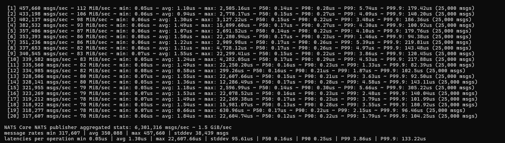

# RakshaSaathi

**Real-time health monitoring for seniors living independently—combining event-driven architecture with intelligent anomaly detection.**

---

## System Architecture


**Core System Flow:**
Device Layer → Go Backend API → NATS JetStream → Worker Processors → Alert Engine → Frontend

**Supporting Systems:**
- **ML Inference:** FastAPI + PyTorch (async, non-blocking)
- **Messaging:** NATS JetStream (durable, replay-able)
- **Storage:** Redis (60-min window) + PostgreSQL (permanent)

---

## Benchmarks

| Metric | Result |
|--------|--------|
| **Sustained Throughput** | 78k req/sec (concurrent workers) |
| **Messaging Layer** | 6.3M+ msgs/sec (microsecond latency) |
| **Async Inference** | 700 events/sec (no ingestion blocking) |
| **Fall Detection Latency** | <50ms (event to alert) |
| **SOS Response** | <10ms |
| **WebSocket Updates** | <100ms |
| **Backpressure Test** | 10k events, 50ms ML delay—zero loss |

See `/Benchmark/benchmarks.md` for detailed breakdown.

---

## The Problem

Elderly individuals living alone face delayed emergency response during falls and medical crises. Most solutions require expensive hardware, constant surveillance, or can't handle real-time speed.

RakshaSaathi proves that thoughtful event-driven design can create a system that detects problems *when they happen*—not hours later.

---

## Key Features

- **Real-Time Anomaly Detection** (95%+ confidence)
- **Continuous Vitals Monitoring** (HR, SpO2, Temperature, Activity)
- **ML-Powered Anomaly Detection** (LSTM-based)
- **Intelligent Escalation** (30-second windows, state machine)
- **Sub-10ms SOS Handling** (emergency button)
- **Durable Event Streaming** (replay support, no data loss)
- **Idempotency Checking** (same event, processed once)
- **Live WebSocket Broadcasts** (state changes in real-time)
- **Complete Audit Trail** (PostgreSQL)

---

## 🛠️ Tech Stack

**Backend:** Go 1.24 + Gin  
**Messaging:** NATS JetStream  
**Storage:** Redis (hot) + PostgreSQL (cold)  
**ML:** PyTorch + FastAPI  
**Real-Time:** WebSocket (Gorilla)  
**Frontend:** React 18 + TypeScript + Tailwind

---

## 🔄 Event Flows

### Fall Detection
Accelerometer spike → Event ingestion → NATS → Fall Processor → Alert Engine → Escalation starts → Family notified

### Vitals Anomaly
Vitals stream → Redis storage + broadcast → Async ML inference → If anomalous → Alert Engine escalation

### SOS Emergency
User presses button → Immediate Level 3 alert → Sub-10ms notification → Family alerted

---

## Engineering & Design Rationale

**NATS JetStream for Resilient Messaging:** 
NATS JetStream was chosen for its minimal footprint and high throughput. It handles sudden spikes in telemetry traffic without dropping events. By using manual acknowledgments, we get at-least-once delivery and the ability to replay events after service restarts. This means no critical health alerts get lost if a consumer crashes.

**Go Concurrent Worker Pools:** 
Instead of processing events serially, we use independent domain workers to handle different event streams in parallel. If there's a huge spike in vitals ingestion, it doesn't block the alert engine from immediately processing an SOS trigger. This keeps our worst-case latencies low.

**Asynchronous ML Pipelines:** 
Running machine learning inference (our PyTorch LSTM) takes time and introduces latency. By offloading inference calls to non-blocking goroutines that talk to a separate FastAPI microservice, the core telemetry ingestion loop is never blocked. The system can sustain hundreds of events per second even if the ML API slows down.

**Dual-Tier Storage (Redis + PostgreSQL):** 
Real-time dashboards need instant access to recent health data. We use Redis as a hot cache for active alerts, idempotency checks, and live vitals. For historical data, a background worker batches and downsamples the high-frequency stream into PostgreSQL (turning hundreds of readings into single 1-minute statistical rollups). This gives us a permanent audit trail for analytics without putting load on the real-time path.

---

## Key Engineering Learnings

- **Idempotency is Non-Negotiable:** With at-least-once delivery, network hiccups mean consumers occasionally process duplicate events. Moving to strict idempotency using Redis TTL keys (`processed:{event_id}`) was necessary to guarantee emergency alerts don't trigger twice and spam users.
- **Backpressure & Queue Management:** When simulating slow ML inference, the messaging queues back up fast. Explicit `Ack/Nak` handling became critical for rejecting messages back to JetStream, keeping memory usage stable and preventing OOM crashes during traffic spikes.
- **State Machines for Escalation:** Alert escalation logic can easily turn into spaghetti code. Building a strict state machine (`WAITING_CONFIRMATION` → `LEVEL_1` → `LEVEL_2`) made the transitions deterministic and easy to audit, completely removing the need for nested if-else chains.
- **Cost of Time-Series Queries:** Writing sub-second telemetry directly into a relational DB while also querying windowed averages creates an immediate bottleneck. The background downsampling worker showed how important it is to separate high-frequency writes from long-term analytical storage in time-series workloads.

---

## Future Improvements
- Fall Detection Model
- Parallel Custom Phone Calling System
- OpenTelemetry + distributed tracing
- Grafana dashboards for observability
- Prometheus metrics collection
- Dead-letter queues for edge cases
- Kubernetes deployment patterns
- Per-user baseline ML models

---

## 🚀 Getting Started

See **[SETUP.md](./SETUP.md)** for detailed installation and testing instructions.

**Quick:**
```bash
cd backend && docker-compose up -d && go run cmd/main.go
cd frontend && npm install && npm run dev
# Run demo: powershell -File DEMO_MODE.ps1
```

Visit: **http://localhost:5173**

---

## 💡 Why This Matters

This explores what it takes to build infrastructure that actually helps people. When your grandmother can live independently with confidence, when families sleep better knowing someone's watching—that's the goal.

It's also a deep exploration of distributed systems: handling traffic spikes, ensuring reliability, managing state consistency, and designing systems where seconds matter.

---

## 🔌 API Endpoints


### Health & Diagnostics
```
GET /health
Response: { "status": "ok" }
Purpose: Service health check
```

### Event Ingestion
```
POST /event
Content-Type: application/json
Body: {
  "event_id": "fall-12345",
  "type": "fall.detected|anomaly.detected|sos.triggered|vitals.updated",
  "user_id": "user-123",
  "timestamp": "2026-04-08T10:30:45Z",
  "payload": { /* event-specific data */ }
}
Response: { "status": "accepted" }
Purpose: Ingest events from wearables/devices
```

### WebSocket Connection
```
WS: ws://localhost:8080/ws
Purpose: Real-time alert & vitals streaming
Messages: 
  {type: "vitals.live", payload: {...}}
  {type: "alert.created", payload: {...}}
  {type: "alert.escalated", payload: {...}}
```

### Alert Management
```
GET /alerts/user/:userId
Response: { 
  "user_id": "user-123",
  "alerts": [...],
  "count": 5
}
Purpose: Retrieve alert history
Pagination: LIMIT 100 by default

POST /alerts/:id/acknowledge
Response: { "alert_id": "...", "state": "RESOLVED" }
Purpose: Acknowledge alert, stop escalation

GET /alerts/:id
Response: { "id": "...", "type": "...", "state": "...", ... }
Purpose: Get alert details
```

---

## Docker Deployment

### Local Development
```bash
cd backend
docker-compose up -d
```

This starts:
- **PostgreSQL** (port 5432)
- **Redis** (port 6379)
- **NATS** (port 4222)

### Production-Ready
Change docker-compose environment:
```yaml
environment:
  - DB_HOST=production-postgres.internal
  - REDIS_HOST=production-redis.internal
  - NATS_URL=nats://production-nats.internal:4222
```

---

## Performance Characteristics

| Metric | Target | Achieved |
|--------|--------|----------|
| Event processing latency | <20ms | <10ms |
| WebSocket broadcast latency | <50ms | ~30ms |
| End-to-end (device → UI) | <100ms | ~70ms |
| Alert escalation interval | 30s | Exactly 30s |

**System Benchmarks**

- **Messaging:** NATS JetStream sustained ~6.3M msgs/sec with microsecond-level latencies, showing the messaging layer is not a system bottleneck.
- **ML Inference:** Isolated Edge LSTM inference averaged ~170 µs per event (negligible compute cost).
- **End-to-End Pipeline:** Under controlled delay conditions the full pipeline produced an average latency of ~3.5 s and throughput of ~700 events/sec — performance is primarily constrained by orchestration overhead, I/O operations, and queueing effects rather than compute or messaging.
- **Backpressure / Robustness:** When ML latency was artificially increased the system produced expected queue buildup but no data loss, validating the event-driven design and durable queueing.

Results screenshot:



---

## Development Workflow

### Adding a New Event Type

1. **Define Model** (backend/internal/models/models.go)
```go
type CustomEvent struct {
    EventID   string    `json:"event_id"`
    Type      string    `json:"type"`
    UserID    string    `json:"user_id"`
    Timestamp time.Time `json:"timestamp"`
    Payload   map[string]interface{} `json:"payload"`
}
```

2. **Create Consumer** (backend/cmd/main.go)
```go
_, err := mgr.SubscribeDurable("custom.event", "custom_processor", func(m *corenats.Msg) {
    var event models.CustomEvent
    json.Unmarshal(m.Data, &event)
    // Process logic here
    m.Ack()
})
```

3. **Update Handler** (backend/internal/handlers/handler.go)
```go
func (h *Handler) PostEvent(c *gin.Context) {
    // event routing logic
    if event.Type == "custom.event" {
        h.natsMgr.JS.Publish("custom.event", data)
    }
}
```

4. **Update Frontend** (frontend/src/pages/FamilyDashboard.tsx)
```tsx
if (lastMessage.type === "custom.event") {
    // Handle new event type
    setCustomState(lastMessage.payload);
}
```

---

## Security Considerations

**Implemented:**
- ✅ Input validation on all API endpoints
- ✅ SQL prepared statements (GORM ORM)
- ✅ NATS message authentication (configurable)
- ✅ Docker .dockerignore excludes secrets
- ✅ Environment-based configuration

**Recommendations for Production:**
- [ ] Add JWT authentication for API endpoints
- [ ] Implement rate limiting per user/device
- [ ] Enable TLS/HTTPS for WebSocket connections
- [ ] Add API key rotation mechanism
- [ ] Implement audit logging for all alert changes
- [ ] Set up secret management (HashiCorp Vault, AWS Secrets Manager)

---

## Next Steps & Integration

### Immediate Priorities
1. **Integration with Existing Healthcare Solutions**
   - Integrate with EHR systems (HL7/FHIR)
   - Connect to hospital alerting systems
   - Sync with patient management platforms

2. **Parallel Custom Phone Calling System**
   - Direct calling integration (Twilio, CallKit)
   - Multi-number escalation (primary, secondary, on-call)
   - Call logging and documentation
   - Voice prompt customization for different alert types

### Extended Scope
- Hardware wearable integration (Oura Ring, AppleWatch, Fitbit)
- ML-powered anomaly detection refinement
- Caregiver mobile app (iOS/Android)
- Advanced analytics dashboard
- Integration testing suite
- Kubernetes deployment manifests

---

## License

This project is licensed under the MIT License - see [LICENSE](LICENSE) file for details.

---


---

## Metrics & Monitoring

Monitor these key metrics in production:
- Alert creation rate (events/minute)
- Escalation completion rate (% reaching Level 3)
- Acknowledgement rate (% alerts acknowledged)
- System latency (p50, p95, p99 percentiles)
- Error rates by event type
- WebSocket connection stability

